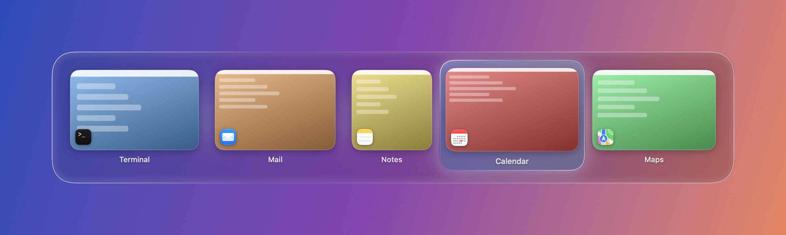
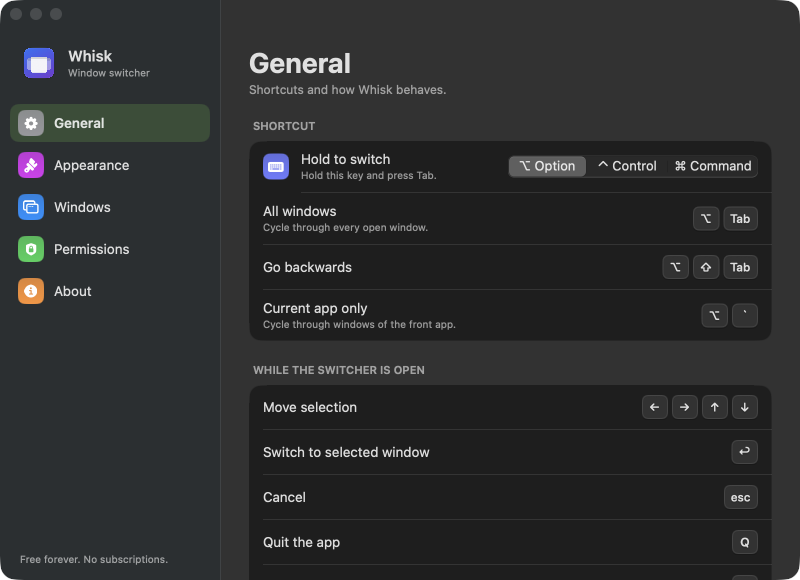
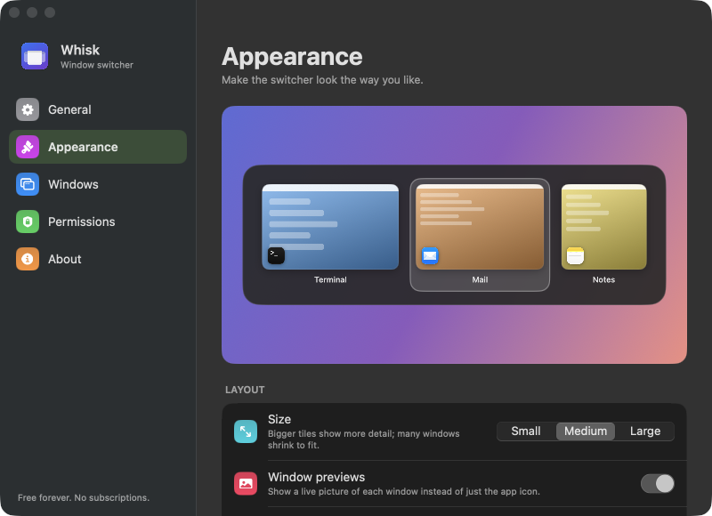
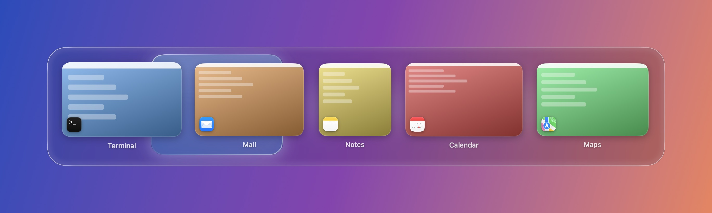

# Whisk

A fast, free window switcher for macOS: press a shortcut, see live previews of every window across all your Spaces, and jump to one. Free forever: no subscriptions, no accounts, no tracking.

Native Swift (SwiftUI + AppKit), macOS 14 or later.



## Features

- **⌥ Tab** switches between all windows, **⌥ ⇧ Tab** goes backwards, **⌥ `** switches between windows of the current app. The hold key can be ⌥, ⌃ or ⌘ (⌘ replaces the system app switcher).
- Hold the key to keep the panel open and release it to switch. A quick tap jumps straight to your previous window without showing the panel.
- **Works across Spaces and fullscreen apps**: pick a window in a fullscreen app (or on another desktop) and Whisk takes you there.
- **Live previews** of every window, including ones on other Spaces and minimized ones.
- While the panel is open: arrow keys, Return, Esc, **Q** quit app, **W** close window, **M** minimize, **H** hide app, plus mouse hover and click. Hovering a tile shows close / minimize / fullscreen buttons.
- **Two designs**: the classic panel, and an experimental **Liquid Glass** design (macOS 26+) where one glass shape flows from window to window, with a Clear ↔ Frosted slider.
- Filters for minimized, hidden, fullscreen and other-Space windows, a per-screen option, an excluded-apps list, light / dark / system theme, three tile sizes, and launch at login.

| Preferences | Appearance, with live preview |
| --- | --- |
|  |  |

The Liquid Glass selection moving between windows:



## Install

There are no prebuilt releases yet, so build it yourself. You need Xcode (or the Xcode command line tools) with a macOS 14+ SDK:

```bash
git clone https://github.com/nithinkr080/Whisk.git
cd Whisk
./build.sh                      # builds build/Whisk.app
open build/Whisk.app
```

Optionally copy it to `/Applications` (needed for "Launch at login" to stick):

```bash
cp -R build/Whisk.app /Applications/
```

Whisk lives in the menu bar and has no Dock icon. Open **Preferences** from the menu bar icon.

### Permissions

On first launch Whisk asks for two macOS permissions (System Settings → Privacy & Security). The Permissions page in Preferences shows their status and links to the right place.

| Permission | Why it is needed |
| --- | --- |
| Accessibility | Detects the keyboard shortcut; raises, closes and minimizes windows |
| Screen Recording | Live window previews (without it you get app icons only) |

Whisk does not record or store your screen, and it makes no network connections. Previews stay in memory and are discarded when the app quits.

The build is signed ad hoc, so macOS may ask you to right-click → Open the first time, and after you rebuild you may need to re-enable the permissions (remove the old Whisk entry and add it again if it looks stuck).

## Things to know

- **It uses private macOS APIs** (a handful of SkyLight / CoreGraphics / Accessibility calls) to find windows on other Spaces and to focus a specific window. That is how every window switcher of this kind works, but it means Whisk cannot be sold on the Mac App Store, and a future macOS update could break parts of it.
- The Liquid Glass design needs macOS 26 or later. Older systems get a frosted-material fallback.
- Windows on other Spaces are discovered with a heuristic, so you may occasionally see a stray window.

## Project layout

| File | Role |
| --- | --- |
| `HotKeyManager.swift` | Global keyboard handling (CGEventTap) |
| `SwitcherController.swift` | The switching session and the floating panel |
| `SwitcherView.swift`, `SwitcherModel.swift` | Classic and Liquid Glass SwiftUI views, tile layout |
| `WindowProvider.swift` | Window discovery and focus / close / minimize actions |
| `Spaces.swift` | Spaces and fullscreen detection |
| `ThumbnailService.swift` | Window thumbnails |
| `PrivateAPIs.swift` | The private symbols in one place |
| `Settings.swift`, `PreferencesView.swift`, `Permissions.swift`, `AppDelegate.swift` | Preferences, onboarding, menu bar |
| `Preview.swift`, `PerfFlags.swift` | Developer aids (see below) |

### Developer aids

The binary has a few hidden modes for testing without driving your screen, for example `--list`, `--prefs-shot <prefix>`, `--liquid-shot <prefix>` and `--real-perf <report>` (frame pacing on your real windows). Run them through `open -n -W build/Whisk.app --args …` so they use the app's own permissions. Set `defaults write io.github.nithinkr080.whisk debugLog -bool true` to log window switches to `~/Library/Logs/Whisk.log`.

## Acknowledgements

Inspired by [AltTab](https://github.com/lwouis/alt-tab-macos) and other macOS window switchers. Whisk is an independent project written from scratch and is not affiliated with or endorsed by AltTab.

## License

[MIT](LICENSE)
